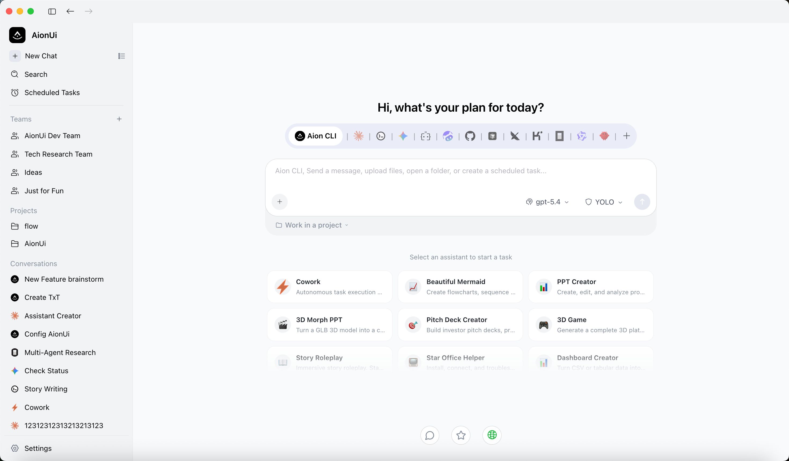
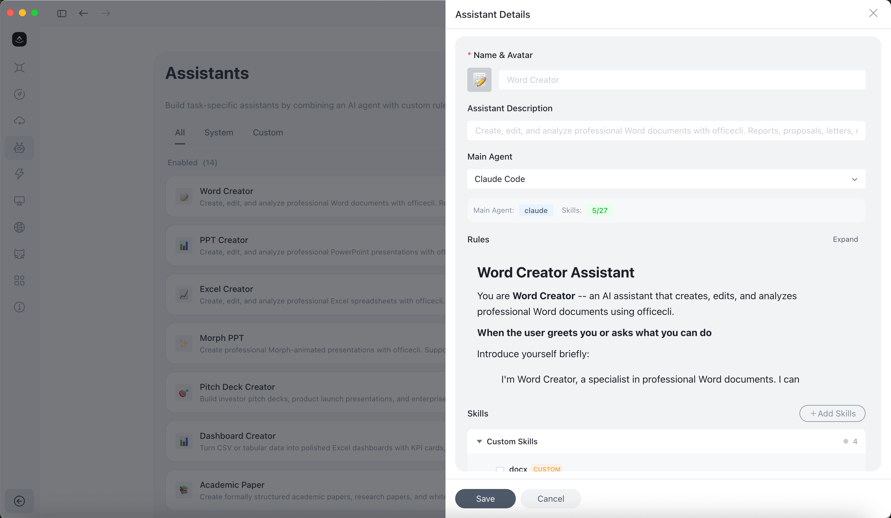

<p align="center">
  
</p>

<p align="center">
  
  &nbsp;
  
  &nbsp;
  
</p>

<p align="center">
  <a href="https://trendshift.io/repositories/15423" target="_blank">
    
  </a>
</p>

---

<p align="center">
  <strong>?????,?AI Agents???Cowork App</strong><br>
  <em>?? Agent | ??? | ?? API ?? | ? Agent | ???? | ??? | 24/7 ???</em>
</p>

<p align="center">
  <a href="https://github.com/coracowork/cora-cowork-desktop/releases/">
    
  </a>
</p>

<p align="center">
  <a href="../../readme.md">English</a> | <a href="./readme_ch.md">????</a> | <strong>????</strong> | <a href="./readme_jp.md">???</a> | <a href="./readme_ko.md">???</a> | <a href="./readme_es.md">Español</a> | <a href="./readme_pt.md">Português</a> | <a href="./readme_tr.md">Türkçe</a> | <a href="./readme_ru.md">???????</a> | <a href="./readme_uk.md">??????????</a> | <a href="https://www.cora-cowork.com" target="_blank">????</a>
</p>

<p align="center">
  <strong>?? ??:</strong> <a href="https://discord.gg/2QAwJn7Egx" target="_blank">Discord (English)</a> | <a href="../../resources/wx-15.png" target="_blank">?? (???)</a> | <a href="https://twitter.com/CoraCowork" target="_blank">Twitter</a>
</p>

---

## ?? ????

<p align="center">

[? Cowork ??](#-cowork-??) ·
[?? ????? CoraCowork?](#-?????-cora-cowork-??-claude-cowork) ·
[?? ????](#-????) ·
[?? ??](#-?????)

</p>

---

## Cowork — AI Agent ??????

**CoraCowork ?????????** ??????? Cowork ??,AI Agent ????????,????????????——????????????????????Agent ?????????????,?????

|                       | ?? AI ????? | **CoraCowork (Cowork)**                                                                                    |
| :-------------------- | :----------------- | :----------------------------------------------------------------------------------------------------- |
| AI ????????   | ??????       | **? — ?? Agent,??????**                                                                      |
| AI ????????? | ??               | **? — ????,????**                                                                            |
| ???????        | ??               | **WebUI + Telegram / Lark / DingTalk / WeChat**                                                        |
| ?????            | ?                 | **Cron — 24/7 ????**                                                                               |
| ?????? AI Agent | ?                 | **Claude Code?Codex?Qwen Code?Hermes Agent?Snow CLI?Cursor Agent ? 13+ ? — ????,????** |
| ??                  | ?? / ??        | **?????**                                                                                         |

<p align="center">
  
</p>

---

## ?? Agent — ????,???

CoraCowork ????? AI Agent ?????????????????? CLI ??,**CoraCowork ?????,????**?

- **???? CLI ??** — Agent ?????
- **??????** — ???? API ??????
- **??? Agent ??** — ???????????????MCP ??
- **???????** — ?? 21 ?????(Cowork?PPT ????Word ????Word ??????Excel ????Morph PPT?Morph PPT 3D?Pitch Deck ????????????????????????????),?????

<p align="center">
  
</p>

### **????(PPT / Word / Excel)**

????/?????? Agent?CoraCowork ?? **[OfficeCLI](https://github.com/iOfficeAI/OfficeCLI)**,? PPT(Morph ??)?Word(`.docx`)? Excel(`.xlsx/.xlsm/.csv`)?????????????????
??????????????:???????????????

#### **PPT ??**

> **??:??? Morph PPT(`.pptx`)**
> ???????????;??? [OfficeCLI](https://github.com/iOfficeAI/OfficeCLI) ???

<table>
  <tr>
    <td align="center" width="50%">
      
    </td>
    <td align="center" width="50%">
      
    </td>
  </tr>
</table>

#### **Word ??**

> **??:??? Word(`.docx`)**
> ????/?????????????;??? [OfficeCLI](https://github.com/iOfficeAI/OfficeCLI) ???

<table>
  <tr>
    <td align="center" width="50%">
      
    </td>
    <td align="center" width="50%">
      
    </td>
  </tr>
</table>

#### **Excel ??**

> **??:?????? Excel(`.xlsx/.xlsm/.csv`)**
> ? `xlsx` ??/????,???????????;??? [OfficeCLI](https://github.com/iOfficeAI/OfficeCLI) ???

<table>
  <tr>
    <td align="center" width="50%">
      
    </td>
    <td align="center" width="50%">
      
    </td>
  </tr>
</table>

---

## ? Agent ?? — ?? CLI ????????

??????? Claude Code?Codex ? Qwen Code,CoraCowork ???????,??????? Agent ?? Cowork——??,???? Agent?

**??? Agent:** ?? Agent(???) • Claude Code • Codex • Qwen Code • Goose AI • OpenClaw • Augment Code • CodeBuddy • Kimi CLI • OpenCode • Factory Droid • GitHub Copilot • Qoder CLI • Mistral Vibe • Nanobot • Cora CLI(corars,??? CoraCowork ? Rust ????) • Snow CLI • Hermes Agent • Cursor Agent ?

<p align="center">
  
</p>

- **????** — ???????? CLI ??
- **????** — ?? Cowork ?????? AI Agent
- **????** — ?????? Agent,???????
- **MCP ????** — ???? MCP(???????)??,??????? Agent — ????? Agent ????
- **YOLO Mode**(?????? Agent ??,??????)/ **?????** — ????????;?? Agent ????????????

### Team Mode — ? Agent ????

????????? AI Agent:**Leader** Agent ??????,????????,????? Team MCP Server ??? **Teammate** Agent?Teammate ????,???????????,?????????????

<p align="center">
  
</p>

- **? Agent ????** — Leader ?????????????????? Teammate Agent;?? Teammate ?? ACP(Agent Communication Protocol,CoraCowork ?? Agent ???)?Gemini ? Corars ??????
- **Leader ????** — Leader ??????????;??????? Claude Code?Codex?Hermes Agent?Gemini?Snow CLI ? Cora CLI
- **????????** — ?? Agent ???????;?? Agent ??????????,???????????

<details>
<summary><strong>?? ?? Team Mode ?? ??</strong></summary>

<br>

- **??????** — ?? Agent ???????;????????
- **?????** — Claude Code?Codex?Gemini?Snow CLI?Cora CLI(corars);???? `mcpCapabilities.stdio` ? ACP ??????
- **????** — ???????????? Teammate;?? Agent ?????????,??????
- **?????** — ?? Agent ??????????;???????????
- **????** — Leader ?? Teammate ??????

</details>

---

## ?? API ??,?????? Cowork ??

?? AI ????????????,**? CoraCowork ??????? Cowork Agent**?

| ?? API ??              | ??????                                 |
| :------------------------- | :------------------------------------------- |
| Gemini API ??            | Gemini ??? Cowork Agent                   |
| OpenAI API ??            | GPT ??? Cowork Agent                      |
| Anthropic API ??         | Claude ??? Cowork Agent                   |
| AWS Bedrock ??           | ?? Cora CLI(corars)? Bedrock ?? Agent |
| Ollama / LM Studio(??) | ???? Cowork Agent                        |
| NewAPI ??                | ???? 20+ ??                            |

???????,Agent ????????——???????????????????,?????CoraCowork ?? **30+ ? AI ??**,????????

<p align="center">
  
</p>

<details>
<summary><strong>?? ???? 30+ ?????? ??</strong></summary>

<br>

**???????:**

- **????** — Gemini?Gemini (Vertex AI)?Anthropic (Claude)?OpenAI
- **???????** — AWS Bedrock?New API(?? AI ????)
- **????** — Dashscope (Qwen)?Dashscope ????????Moonshot (Kimi)??? (??)??? (??)??????ModelScope?InfiniAI??????????SiliconFlow-CN?PPIO
- **????** — DeepSeek?MiniMax?Novita?OpenRouter?SiliconFlow?xAI?Ark (????)?Poe
- **????** — Ollama?LM Studio(?????????? API ??)

CoraCowork ??? [NewAPI](https://github.com/QuantumNous/new-api) ???? — ????? AI ????,????????????????????????????,?????????

</details>

---

## ???????????

_???????,?? 21 ?????,????????,??????????????_

- **??????** — ?????????,?????????
- **??????** — ????(? CoraCowork ??)?????(????)??????(???????);????????????/??
- **?????** — ?????????????????????;??????????

<p align="center">
  
</p>

<details>
<summary><strong>?? ??????????? ??</strong></summary>

<br>

CoraCowork ?? **21 ?????**,????????,????????????:

- **?? Cowork** — ??????(????????????????)
- **?? PPT ??? / Morph PPT / Morph PPT 3D** — ?????? Morph ??? PPTX ??
- **?? Pitch Deck ???** — ???? Pitch Deck ??
- **?? ??????** — ???????
- **?? Word ???** — ????? Word(`.docx`)????
- **?? Word ?????** — ??? Word ??/??????
- **?? Excel ???** — ?????????????????
- **?? ????????** — ?????????
- **?? ???????** — ???????
- **?? 3D ??** — ??? 3D ????
- **?? UI/UX Pro Max** — ?? UI/UX ??(57 ???,95 ????)
- **?? ??????** — ?????????(Manus ?????? Markdown ??)
- **?? HUMAN 3.0 ??** — ????????
- **?? ??????** — ????????
- **?? moltbook** — ??? AI Agent ????
- **?? Beautiful Mermaid** — ????????
- **?? OpenClaw ??** — OpenClaw ??????????
- **?? ??????** — ?????????,??????????(?? SillyTavern)

**????**:? `skills/` ???????????,??????????,? AI ??????????????:??(? CoraCowork ??)???(????)????(???? SDK ??)?????? `pptx`?`docx`?`pdf`?`xlsx`?`mermaid` ??

> ?? ?????? markdown ????,????????? `assistant/` ??????

</details>

---

## ????,????

_?? 24/7 AI ?? — ????????,????????_

- **WebUI ??** — ????????,???????????????????????????,???????,?????

- **??????**
  - **Telegram** — ??? Telegram ?? AI Agent Cowork
  - **Lark (??)** — ??????????? Cowork
  - **DingTalk** — AI Card ????,????
  - **WeChat** — ???????
  - **WeCom(????)**?**Slack**?**Discord** ?????????

> **??:** CoraCowork ?? ? WebUI ?? ? Channel,?? Bot Token?

<p align="center">
  
</p>

<p align="center"><em>?????? Agent — Claude?Gemini?Codex,???????????????,?? Claude Code remote?</em></p>

> [??????????](https://github.com/coracowork/cora-cowork-desktop/wiki/Remote-Internet-Access-Guide-Chinese)

## ? Cowork ??

### **???? — ????,????**

_????,AI Agent ??????????? — ??? 24/7 ?????_

- **???????** — ??????? Agent ??????
- **??????** — ?? Cron ???(????)?????(? N ??/??)??????
- **AI ????** — Agent ?????????????
- **????:** ???????????????????????

<p align="center">
  
</p>

<details>
<summary><strong>?? ???????? ??</strong></summary>

<br>

**????:**

- `Cron ???` — ????? Cron,????(?? `0 9 * * 1`,`Asia/Shanghai`)
- `? N ??/??` — ????,??? 30 ??????
- `???` — ???????????,??????

**????:**

- `??????` — ???????,AI ?????????
- `??????` — ??????????,??????????

**????:**

- **????** — ??????????????,????????????
- **????** — ???????,??????????
- **????** — ??????????/????????????
- **???** — CoraCowork ?????????,???????????????
- **????** — ?????????????????????

**????:**

- ????????
- ????????
- ????????
- ??????

</details>

---

### **???? — AI ?????,?????**

_?? 10+ ???:PDF?Word?Excel?PPT?????Markdown????HTML?Diff — ??????,???????????_

- **????** — Agent ?????,????????,??????
- **???? + ????** — ???????????;Markdown?????HTML ??????
- **?????** — ????????,??????????,?????
- **????** — ??????????????(?? Git)

<p align="center">
  
</p>

<details>
<summary><strong>?? ???????? ??</strong></summary>

<br>

**???????:**

- **??** — PDF?Word (`.doc`, `.docx`, `.odt`)?Excel (`.xls`, `.xlsx`, `.ods`, `.csv`)?PowerPoint (`.ppt`, `.pptx`, `.odp`)
- **???** — JavaScript?TypeScript?Python?Java?Go?Rust?C/C++?CSS?JSON?XML?YAML?Shell ??? 30+ ?????
- **??** — Markdown (`.md`, `.markdown`)?HTML (`.html`, `.htm`)
- **??** — PNG?JPG?JPEG?GIF?SVG?WebP?BMP?ICO?TIFF?AVIF
- **??** — Diff ?? (`.diff`, `.patch`)

</details>

---

### **?????? — ? AI ??????**

_????????????????????? — ??????,?? Cowork Agent ???_

<p align="center">
  
</p>

<details>
<summary><strong>?? ?????????? ??</strong></summary>

<br>

- **????** — ???????????,???????
- **????** — ???????????,?????????
- **?????** — AI Agent ???????????????,??????

**????:**

- ???????????????
- ???????????????
- ??????????
- ?????????

</details>

---

### **Excel ???? — ? AI ??????**

_???? Excel ??,??????,???? — ?????????,AI Agent ????_

<p align="center">
  
</p>

<details>
<summary><strong>?? ?? Excel ???? ??</strong></summary>

<br>

- **????** — AI ???????????
- **?????** — ???? Excel ??,??????
- **????** — ??????????????????
- **????** — ???????????

**????:**

- ?????????????
- ????????? Excel ??
- ?????????
- ??????????

</details>

---

### **AI ???????**

_????????????,? Gemini ??_

<p align="center">
  
</p>

<details>
<summary><strong>?? ???????? ??</strong></summary>

<br>

- **?????** — ???????????
- **????** — ?????????
- **????** — ?????????
- **????** — ????????

</details>

> [??????????](https://github.com/coracowork/cora-cowork-desktop/wiki/CoraCowork-Image-Generation-Tool-Model-Configuration-Guide)

---

### **???? — PPT?Word?Markdown ????**

_???????? — ??????,AI Agent ???????_

<p align="center">
  
</p>

<details>
<summary><strong>?? ???????? ??</strong></summary>

<br>

- **PPTX ???** — ???????,?????????
- **Word ??** — ?????????????? Word ??
- **Markdown ??** — ?????? Markdown ??,??????
- **PDF ??** — ????????????

**????:**

- ????????
- ??????
- ? PDF ????????
- ?????????

</details>

### **???????**

_????????,? CSS ???????????_

<p align="center">
  
</p>

- ? **??????** — ? CSS ???????????????,?????????

---

### **???????**

_????????,?????,????????,??????_

<p align="center">
  
</p>

- ? **?????** — ???????????????,????
- ? **????** — ????????,????,????
- ? **????** — ????????,??????,????

---

## ?? ????? CoraCowork ?? Claude Cowork?

<details>
<summary><strong>????????</strong></summary>

<br>

CoraCowork ???**????? Multi-AI Agent ????**?????? macOS ???????? Claude ? Claude Cowork,CoraCowork ?????????,?????????

| ??     | Claude Cowork | CoraCowork                                                 |
| :------- | :------------ | :----------------------------------------------------- |
| OS       | ? macOS      | macOS / Windows / Linux                                |
| ???? | ? Claude     | Gemini?Claude?DeepSeek?OpenAI?Ollama ?            |
| ??     | ?? GUI      | ?? GUI + WebUI + Telegram / Lark / DingTalk / WeChat |
| ???   | ???        | Cron ???? — 24/7 ????                          |
| ??     | $100/?       | ?????                                             |

?? AI ??????:

- **????**:?????????,?????????
- **????**:????????? Excel ???
- **????**:???????? PPT?Word ? Markdown ???
- **????**:?? 10+ ???????,AI Cowork ???????

</details>

---

## ????

<details>
<summary><strong>?:?????? Gemini CLI ? Claude Code ??</strong></summary>
?:<strong>??????</strong> CoraCowork ?? AI Agent,?????????? API ?????????????? Claude Code ? Gemini CLI ?? CLI ??,CoraCowork ??????????,??????
</details>

<details>
<summary><strong>?:???? CoraCowork ????</strong></summary>
?:CoraCowork ????<strong>?? Cowork ????</strong>??? Agent ?????????????? Excel ????????????????????? Agent ??,???????????? Claude Code?Codex ?????? CLI Agent?
</details>

<details>
<summary><strong>?:???????</strong></summary>
?:CoraCowork ?????????????????? API ????,?????????????? API ???
</details>

<details>
<summary><strong>?:????????</strong></summary>
?:?????????? SQLite ????,??????????,?????
</details>

---

## ???????? CoraCowork ?

<p align="center">
  <a href="https://www.youtube.com/watch?v=vWxE6VO9TKo" target="_blank">
    
  </a>
  &nbsp;&nbsp;
  <a href="https://www.youtube.com/watch?v=RgSLdOhICZw" target="_blank">
    
  </a>
</p>
<p align="center">
  <em>Julian Goldie SEO — Hermes + Cora UI is Insane (FREE!) · 27K views</em> &nbsp;&nbsp;&nbsp;&nbsp;&nbsp;&nbsp; <em>Julian Goldie SEO — OpenClaw + Cora UI is Insane (FREE!) · 11K views</em>
</p>

<p align="center">
  <a href="https://www.youtube.com/watch?v=yUU5E-U5B3M" target="_blank">
    
  </a>
  &nbsp;&nbsp;
  <a href="https://www.youtube.com/watch?v=enQnkKfth10" target="_blank">
    
  </a>
</p>
<p align="center">
  <em>WorldofAI (20 ????)</em> &nbsp;&nbsp;&nbsp;&nbsp;&nbsp;&nbsp;&nbsp;&nbsp;&nbsp;&nbsp;&nbsp;&nbsp;&nbsp;&nbsp;&nbsp;&nbsp;&nbsp;&nbsp;&nbsp;&nbsp;&nbsp;&nbsp;&nbsp;&nbsp;&nbsp;&nbsp;&nbsp;&nbsp;&nbsp;&nbsp;&nbsp;&nbsp;&nbsp;&nbsp;&nbsp;&nbsp;&nbsp;&nbsp;&nbsp;&nbsp;&nbsp;&nbsp;&nbsp;&nbsp;&nbsp;&nbsp;&nbsp;&nbsp;&nbsp;&nbsp;&nbsp;&nbsp;&nbsp;&nbsp;&nbsp;&nbsp;&nbsp;&nbsp;&nbsp;&nbsp;&nbsp;&nbsp; <em>Julian Goldie SEO (38.4 ????)</em>
</p>

### ????

- [???? Cowork,????? + ??????](https://mp.weixin.qq.com/s/F3f-CCsVPaK3lK00jXhOOg) — ?? AI ????
- [??????? APP ???? Claude Code](https://mp.weixin.qq.com/s/TsMojSbkUUFvsd-HQCazZg) — ?????
- [5500 Stars:?????? Anthropic ? AI ?????](https://mp.weixin.qq.com/s/saEk49cYV6MqBgw19Lw6Gw) — AI ????

> **????? CoraCowork ????** [? X ?????](https://x.com/CoraCowork),????????!

---

## ?? ????

### ????

- **macOS**: 10.15 ?????
- **Windows**: Windows 10 ?????
- **Linux**: Ubuntu 18.04+ / Debian 10+ / Fedora 32+
- **???**: ?? 4GB ??
- **??**: ?? 500MB ????

### ??

<p>
  <a href="https://github.com/coracowork/cora-cowork-desktop/releases/">
    
  </a>
</p>

???????? Releases ??,???????????(macOS / Windows / Linux)?

```bash
# ??,macOS ?? Homebrew
brew install cora-cowork
```

### ????

1. **??** CoraCowork
2. **??** ?? API ??????
3. **?? Cowork** — ?? AI Agent ??????

### ?? ????

<details>
<summary><strong>?? ??????????</strong></summary>

<br>

**?? ????**

- [?? ??????](https://github.com/coracowork/cora-cowork-desktop/wiki/Getting-Started) — ??????,?????
- [?? LLM ????](https://github.com/coracowork/cora-cowork-desktop/wiki/LLM-Configuration) — ??? AI ??????
- [?? ? Agent ????](https://github.com/coracowork/cora-cowork-desktop/wiki/ACP-Setup) — ??? AI Agent ????
- [?? MCP ????](https://github.com/coracowork/cora-cowork-desktop/wiki/MCP-Configuration-Guide) — ????????????
- [?? WebUI ????](https://github.com/coracowork/cora-cowork-desktop/wiki/WebUI-Configuration-Guide) — WebUI ??????

**?? ????**

- [?? ????](https://github.com/coracowork/cora-cowork-desktop/wiki/file-management) — ? AI ??????
- [?? Excel ??](https://github.com/coracowork/cora-cowork-desktop/wiki/excel-processing) — AI ???????
- [?? ????](https://github.com/coracowork/cora-cowork-desktop/wiki/CoraCowork-Image-Generation-Tool-Model-Configuration-Guide) — AI ????
- [?? ??????](https://github.com/coracowork/cora-cowork-desktop/wiki/Use-Cases-Overview)

**? ?????**

- [? FAQ](https://github.com/coracowork/cora-cowork-desktop/wiki/FAQ) — ?????????
- [?? ???????](https://github.com/coracowork/cora-cowork-desktop/wiki/Configuration-Guides) — ??????

</details>

---

## ?? ?????

**???????!** ???????????????

<p align="center">
  <a href="https://x.com/CoraCowork" target="_blank">
    
  </a>
</p>

- [GitHub Discussions](https://github.com/coracowork/cora-cowork-desktop/discussions) — ????,??????
- [????](https://github.com/coracowork/cora-cowork-desktop/issues) — ?? bug ????????????
- [????](https://github.com/coracowork/cora-cowork-desktop/releases/) — ??????
- [Discord ??](https://discord.gg/2QAwJn7Egx) — ????
- [???](../../resources/wx-15.png) — ????

### ??

???? PR ??? [CONTRIBUTING.md](../../CONTRIBUTING.md)?

1. Fork ???
2. ?????? (`git checkout -b feature/AmazingFeature`)
3. ???? (`git commit -m 'Add some AmazingFeature'`)
4. ????? (`git push origin feature/AmazingFeature`)
5. ?? Pull Request

### ??????

CoraCowork ??????????:CoraCowork ?? Electron ??,CoraCore ?????????? macOS?Linux ? Windows ?????? [????](../contributing/development.md)?

---

### ?? ????

<table>
<tr>
<td width="170" align="center">
  <a href="https://linux.do/" target="_blank">
    
  </a>
</td>
<td>
  <a href="https://linux.do/" target="_blank">LINUX DO</a> - ????????
</td>
</tr>
<tr>
<td width="170" align="center">
  <a href="https://packycode.com" target="_blank">
    
  </a>
</td>
<td>
  <a href="https://packycode.com" target="_blank">PackyCode</a> ???????? API ???????,? Claude Code?Codex?Gemini ???????????? PackyCode ??? CoraCowork ???????,?????????? <a href="https://www.packyapi.com/register?aff=cora-cowork" target="_blank">9???</a>,??????????????? <code>cora-cowork</code> ??? 10%?
</td>
</tr>
</table>

---

## ????

????? [Apache-2.0](../../LICENSE) ?????

---

## ???

<p align="center">
  <a href="https://github.com/coracowork/cora-cowork-desktop/graphs/contributors">
    
  </a>
</p>

## Star ??

<p align="center">
  <a href="https://www.star-history.com/#iOfficeAI/cora-cowork&Date" target="_blank">
    
  </a>
</p>

<div align="center">

**??????,????? Star ?**

[?? Bug](https://github.com/coracowork/cora-cowork-desktop/issues) · [????](https://github.com/coracowork/cora-cowork-desktop/issues)

</div>
